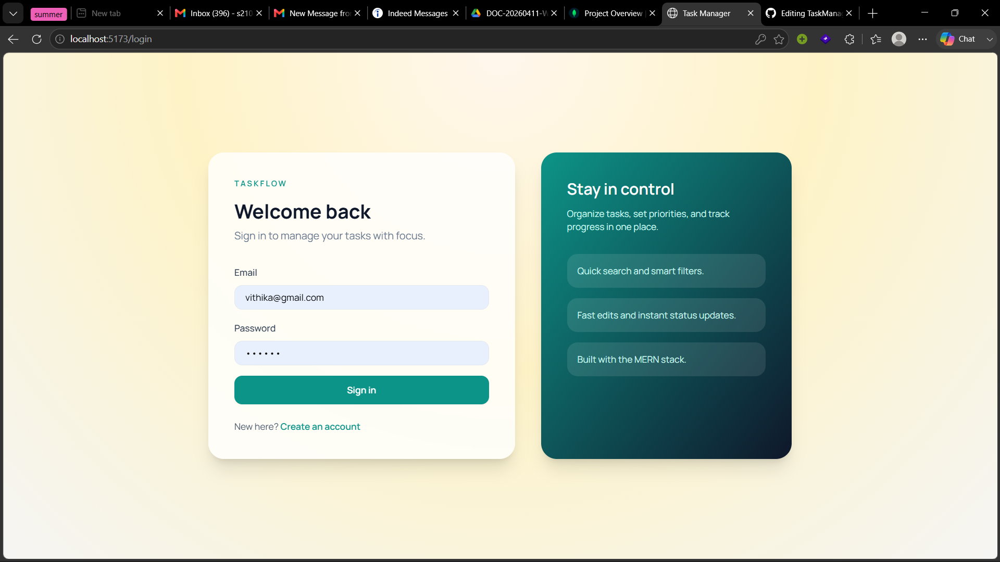
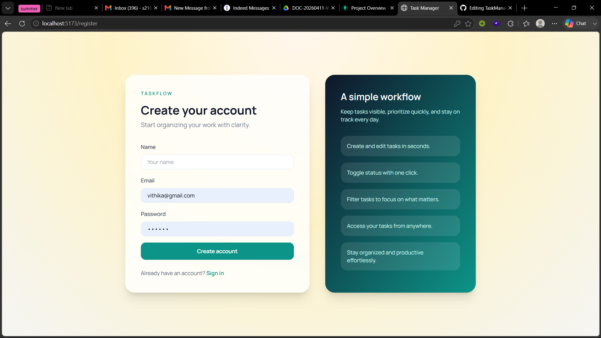
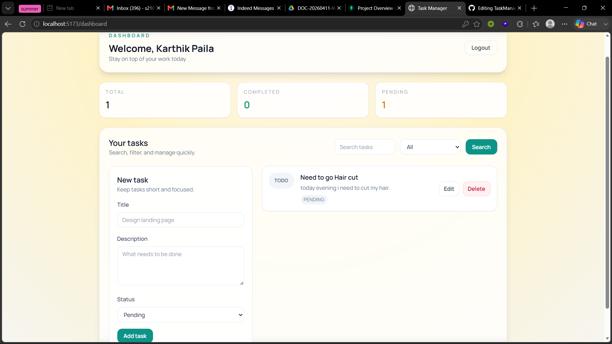

# TaskFlow - MERN Task Manager

A clean and responsive task manager built with MongoDB, Express, React, and Node. It includes secure authentication, smooth CRUD operations, and fast search and filter features.

## Features

- Register and login with JWT
- Create, edit, delete, and toggle tasks
- Search by title or description
- Filter by status (pending or completed)
- Responsive UI with Tailwind CSS

## Bonus Coverage

- Search and filter are implemented
- Pagination is intentionally not included

## Tech Stack

- Frontend: React, Vite, Tailwind CSS
- Backend: Node.js, Express, MongoDB, Mongoose
- Auth: JWT, bcrypt

## Project Structure

```
client
server
```

## Quick Start

### Prerequisites

- Node.js 18+
- MongoDB (local or Atlas)

### 1) Server

1. Open a terminal in the `server` folder
2. Install dependencies
   ```bash
   npm install
   ```
3. Create a `.env` file using `.env.example` as a template
4. Start the server
   ```bash
   npm run dev
   ```

### 2) Client

1. Open a terminal in the `client` folder
2. Install dependencies
   ```bash
   npm install
   ```
3. Create a `.env` file using `.env.example` as a template
4. Start the client
   ```bash
   npm run dev
   ```

## Environment Variables

Server `.env`

```
MONGO_URI=your_mongodb_connection_string
JWT_SECRET=your_jwt_secret
PORT=5000
CLIENT_ORIGIN=http://localhost:5173
```

Client `.env`

```
VITE_API_URL=http://localhost:5000
```

## Scripts

Server:

- `npm run dev` - start server with nodemon
- `npm start` - start server

Client:

- `npm run dev` - start Vite dev server
- `npm run build` - build for production
- `npm run preview` - preview production build

## API Overview

Base URL: `/api`

Auth:

- `POST /auth/register`
- `POST /auth/login`
- `GET /auth/me`

Tasks (protected):

- `GET /tasks?search=&status=`
- `POST /tasks`
- `PUT /tasks/:id`
- `PATCH /tasks/:id/toggle`
- `DELETE /tasks/:id`

## Screenshots





## Notes

- Make sure both client and server are running for full functionality.
